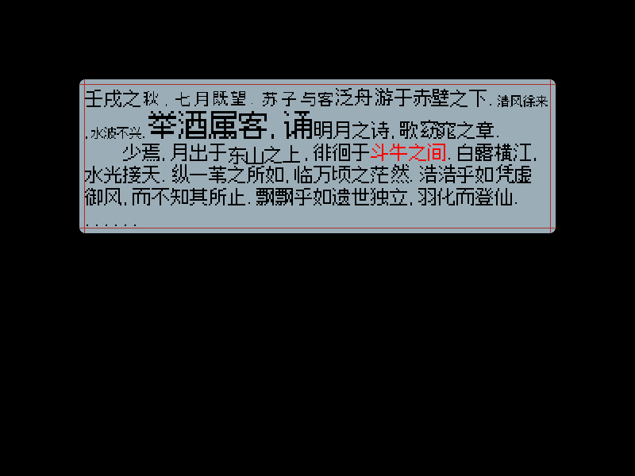
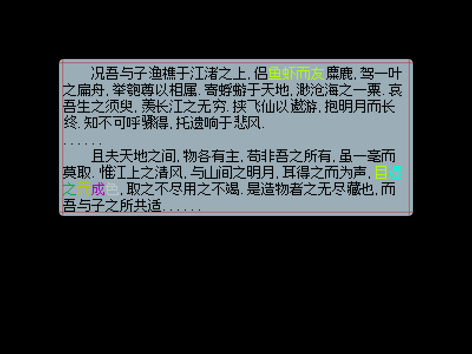

# [脚本] SMBX38A 富文本和对话框

这是先前为 city of drank 做的解决方案。

## 背景

smbx38a 的默认对话框存在一些问题：

- 效果少
- 扩展困难
- 编码不规范（非 ascii 字符在不同环境中会出现乱码）
- ……

为了实现高度定制化的文本框，通常需要弃用引擎默认的对话框，使用 bitmap 自行绘制文本。有一种做法是先将固定的文本句子制作成一整张贴图，在运行时动态调度。但是这种方案通用性差，且制作/修改成本高昂（需要为每组对话单独制作对应的贴图或贴图集）。为此，这里设计了一套相对更为通用的富文本和对话框系统。

## 使用方法

为了便于使用，该该方案提供尽可能简单直接的使用接口，一些非必要或者较为低级的接口会标记为  `LowLevel`。

### 基本概念

#### 文本与编码

为了避免 smbx38a 的字符串在不同环境下出现**编码错误**的问题，该方案将**字符编码成 ascii 数据串**（下称 A 串），再在 teascript 中运行时动态解码为 utf16 数据串（下称 D 串），最后再由 TXT 函数整理为格式化的文本（下称 T 串）。

综上，该解决方案中，文本有 3 种形态：

对于文本 `我能吞下玻璃而\{n}不伤身体`

- A 串：
  ```vbscript
  Dim ascSrc As String = "``S#^+d:})d#12SD]' !E#C$L(x+h+`)n"
  ```

- D 串：
  ```vbscript
  Dim data As String = D("``S#^+d:})d#12SD]' !E#C$L(x+h+`)n") ' A 串到 D 串: D(ascSrc)
  ```

- T 串：
  ```vbscript
  Dim textStr As String = TXT(D("``S#^+d:})d#12SD]' !E#C$L(x+h+`)n")) ' D 串到 T 串 TXT(data)
  ```

在代码字面量种，使用 A 串书写，而最终，对话框系统应该接受的是 T 串的数据。

#### 对话框类型

对话框系统将对话框分成了两个类型：**轻量对话框**（TextboxLite）和**主对话框**（Textbox）。轻量对话框类似玩家或者 npc 头顶上冒出来的气泡，可以跟随玩家/npc/bitmap…等对象运动，不支持富文本，且**同屏最多存在 8 个**。主对话框在屏幕正中，支持富文本，一次只能有 1 个。后面会对这两种对话框进行展开介绍。

### 将文本编码为 A 串

文本的编码需要使用外部工具：`./CSUtil/Release/FontAtlasGenerator.exe`；具体使用方式见：`./CSUtil/README.md`

简要地说，将 `*.smt` 后缀的 teascript 脚本文件拖放到 FontAtlasGenerator.exe 上，程序就会将脚本中所有的形如 `$"我能吞下玻璃而\{n}不伤身体"` 的字符串替换为 `TXT(D("``S#^+d:})d#12SD]' !E#C$L(x+h+``)n"))`，并将结果导出到 `encoded-*.smt` 中

### 将 A 串解码为 D 串或 T 串

文本的解码需要借助 `FontAtlasGenerator.exe` 生成的 `TxtDecoder.smt`，该文件提供了 `D()` 函数和 `TXT()` 函数，用于在各种类型的字符串间转换。原则上，`TxtDecoder.smt` 需要在游戏最开始被执行（至少应该在第一个使用到该库的事件前被执行），使用时请将其绑定到一个游戏开始事件上，或使用 ExeScript() 拉起。

### 对话框

对话框依赖 `./Teascripts/Release/Textbox.smt`，这个脚本提供了所有可能需要的对话框相关接口。它内部有一个自循环，可以自动管理对话框的生命周期、动画和状态。同样的，它也需要在游戏最开始被执行，最好晚于 `TxtDecoder.smt` 的运行时间，不过这个时序不强求。

在 `TxtDecoder.smt` 的前面有一大块可设置的配置项，可以自行定义文本框、字体图集的 npc id、九宫格尺寸等。如有需求请留意：

```vbscript
' -------------------------------------------------------------------
' -------------------------------------------------------------------
' -------------------------------------------------------------------
' ------------------------- smbx 38a 动态文本框实现 - xiaodou 20250606
' ------------------------- 该脚本基于字符贴图集绘制脚本 TXT_ 实现
' ------------------------- 请确保您预先将其导入进关卡环境中并运行了....
' -------------------------------------------------------------------
' ----------------------------------------------------- lite text box config
Dim __lBox_char_npcId As Long = 1           ' 字符素材 npc id
Dim __lBox_bmpIdStart As Long = 20000       ' bmp 起始 id
Dim __lBox_defaultZpos As Double = 0.5      ' 默认 zpos
Dim __lBox_9Grid_npcId As Long = 2          ' 九宫格素材 npc id
Dim __lBox_9Grid_x As Long = 0
Dim __lBox_9Grid_y As Long = 0
Dim __lBox_9Grid_w As Long = 18             '    a   w   c
Dim __lBox_9Grid_h As Long = 18             '  b ┌┬─────┬─┐
Dim __lBox_9Grid_a As Long = 07             '    ├┼─────┼─┤
Dim __lBox_9Grid_b As Long = 07             '    ││     │ │ h
Dim __lBox_9Grid_c As Long = 07             '    ├┼─────┼─┤
Dim __lBox_9Grid_d As Long = 07             '    └┴─────┴─┘ d ---- 九宫格六个参数
Dim __lBox_max_char As Integer = 200        ' 最大字符数

' ----------------------------------------------------- text box config
Dim __msg_bmpIdStart As Long = 10000       ' bmp 起始 id, 该类一共需要申请 10 个 bmp, +1~9 为九宫格, +0 为头像
Dim __msg_defaultZpos As Double = 0.51     ' 默认 zpos
Dim __msg_9Grid_npcId As Long = 2          ' 九宫格素材 npc id
Dim __msg_9Grid_x As Long = 0
Dim __msg_9Grid_y As Long = 0
Dim __msg_9Grid_w As Long = 18             '    a   w   c
Dim __msg_9Grid_h As Long = 18             '  b ┌┬─────┬─┐
Dim __msg_9Grid_a As Long = 07             '    ├┼─────┼─┤
Dim __msg_9Grid_b As Long = 07             '    ││     │ │ h
Dim __msg_9Grid_c As Long = 07             '    ├┼─────┼─┤
Dim __msg_9Grid_d As Long = 07             '    └┴─────┴─┘ d ---- 九宫格六个参数

' ----------------------------------------------------- rich text config
Dim __box_npc As Long = 1                             ' 文本贴图集
Dim __box_bmpStart As Long = __msg_bmpIdStart + 10    ' 文本 bmp 起始 id
Dim __box_bmpZpos As Double = 0.5                     ' 文本 zpos

Dim __box_wid As Integer = 600                        ' 文本框宽度限制, -1 为无限制 [-1, 10000]
Dim __box_hei As Integer = -1                         ' 文本框高度限制, -1 为无限制 [-1, 10000]
Dim __box_posX As Integer = 100                       ' 文本框位置 (屏幕坐标) [-10000, 10000]
Dim __box_posY As Integer = 100                       ' 文本框位置 (屏幕坐标) [-10000, 10000]
Dim __box_size As Integer = 24                        ' 文本基础大小 [0, 10000]
Dim __box_charSpacing As Integer = 0                  ' 字符间距 [-10000, 10000]
Dim __box_lineSpacing As Integer = 2                  ' 行距 [-10000, 10000]
Dim __box_alignType As Integer = 0                    ' 对齐方式 default-left | 1-right | 2-mid
```


#### 轻型对话框（TextboxLite）

轻型对话框提供了如下接口：

 ```vbscript
 ' 设置跟随目标的 id
 ' @param id 跟随目标 id
 ' @param type 跟随目标类型:
 '     1 - 跟随 npc
 '     2 - 跟随 bitmap
 '     3 - 跟随 character
 '     4 - 跟随 block
 '     5 - 跟随 bgo
 Export Script TextboxLite_StoreTargetId(id As Integer, type As Integer)
 
 ' 设置位置 (场景坐标系)
 ' @param x x 坐标
 ' @param y y 坐标
 Export Script TextboxLite_StorePos(x As Long, y As Long)
 
 ' 设置锚点
 ' @param x x 轴向锚点 [0, 1]
 ' @param y y 轴向锚点 [0, 1]
 Export Script TextboxLite_StoreAnchor(x As Double, y As Double)
 
 ' 设置宽度限制
 ' @param x 宽度限制
 Export Script TextboxLite_StoreWidth(x As Integer)
 
 ' 设置最大停留时间 (单位为帧)
 ' @param x 最大停留时间
 Export Script TextboxLite_StoreTime(x As Integer)
 
 ' 设置字体大小
 ' @param x 字体大小
 Export Script TextboxLite_StoreSize(x As Integer)
 
 ' 设置字体颜色
 ' @param r 字体颜色红色通道
 ' @param g 字体颜色绿色通道
 ' @param b 字体颜色蓝色通道
 Export Script TextboxLite_StoreColor(r As Integer, g As Integer, b As Integer)
 
 ' 清除所有小对话框
 Export Script TextboxLite_Clear()
 
 ' 新增小对话框
 ' @param content 对话框内容 (已格式化文本)
 ' @return 是否成功新增
 Export Script TextboxLite_Submit(content As String, Return Integer)
 ```

形如 TextboxLite_Store...  的接口用于在 Submit 对话框前设置相关参数。在 Submit 完毕后，设置的所有参数会被清空为默认值（其中，停留时间的默认值为 240 帧）。也就是说，每次 Submit 前都要对相关参数进行 Store。具体操作哪些参数视情况而定。

一个屏幕内最多只能同时存在 8 个小型对话框，如果当前屏幕中已经存在了 8 个，且此时进行了一次新的 Submit，则小型对话框系统就会自动销毁最早 Submit 的那个对话框。

使用例：

```vbscript
' 将字面量转换为 T 串
Dim a As String = TXT(D("``S#^+d:})d#12SD]' !E#C$L(x+h+`)n"))

' 设置文本框锚点 (这里是左下角)
Call TextboxLite_StoreAnchor(0, 1)
' 设置文本框位置(用场景坐标系)
Call TextboxLite_StorePos(sysval(player1scrx) + 200, sysval(player1scry) + 200)
' 设置文本框最大宽度(高度是根据文字自适应的, 无法手动设置)
Call TextboxLite_StoreWidth(100)
' 设置文字大小(0 为默认大小)
Call TextboxLite_StoreSize(0)

' 设置文本框驻留时间 (这里是 480 帧), 时间结束后会自动销毁
Call TextboxLite_StoreTime(480)
' 提交 T 串文本到文本框系统
' Submit 完毕后 Store 的参数会自动恢复为默认值, 下次 Submit 前要重新 Store
Call TextboxLite_Submit(a)
```


#### 主对话框（Textbox）

主对话框的接口分为高层和底层两类

高层接口：

```vbscript
' 设置对话框位置 (屏幕坐标)
' @param x x 位置
' @param y y 位置
Export Script Textbox_StoreMsgPos(x As Integer, y As Integer)

' 设置对话框尺寸
' @param w 宽
' @param h 高
Export Script Textbox_StoreMsgSize(w As Integer, h As Integer)

' 设置对话框头像
' @param npcId 头像的 npc id
' @param srcX 头像在 npc 贴图中的 x 位置
' @param srcY 头像在 npc 贴图中的 y 位置
' @param srcW 头像在 npc 贴图中的宽
' @param srcH 头像在 npc 贴图中的高
Export Script Textbox_StoreAvatar(npcId As Long, srcX As Integer, srcY As Integer, srcW As Integer, srcH As Integer)

' 设置头像位置 (屏幕坐标)
' @param x x 位置
' @param y y 位置
Export Script Textbox_StoreAvatarPos(x As Integer, y As Integer)

' 设置头像尺寸
' @param w 宽
' @param h 高
Export Script Textbox_StoreAvatarSize(w As Integer, h As Integer)

' 直接设置头像 (可以用于快速修改头像表情, 没有任何过渡动画, 也不支持改变头像大小)
' @param npcId 头像的 npc id
' @param srcX 头像在 npc 贴图中的 x 位置
' @param srcY 头像在 npc 贴图中的 y 位置
' @param srcW 头像在 npc 贴图中的宽
' @param srcH 头像在 npc 贴图中的高
Export Script Textbox_SetAvatarImm(npcId As Long, srcX As Integer, srcY As Integer, srcW As Integer, srcH As Integer)

' 提交对话文本 (T 串)
' @param txt T 串文本
' @param animStartFac 过渡动画设置 -1: 退场和入场; 0: 仅入场; 1: 硬切无动画
Export Script Textbox_Submit(txt As String, animStartFac As Double)

' 解除等待
Export Script Textbox_Continue()

' 绘制到下一个 wait flag 处
Export Script Textbox_DrawToWait(Return Integer)

' 获取事件信息
' @return 事件信息字符串
Export Script Textbox_GetEventInfo(Return String)
```

底层接口：

```vbscript
' 加载 string
' @param ss: 要加载的 string (T 串)
Export Script TextboxLowLevel_LoadString(ss As String, Return Integer)

' 无视所有阻拦绘制到目标探针
' @param seek: 绘制目标(若要绘制到结尾则 seek 可以填 10000)
Export Script TextboxLowLevel_DrawToSeek(seek As Long, Return Integer)

' 绘制下一个字符
Export Script TextboxLowLevel_DrawNext(Return Integer)

' 销毁
Export Script TextboxLowLevel_Destroy()

' 设置字符贴图集 npc
' @param id: 字符贴图集 npc id
Export Script TextboxLowLevel_SetNpcSrc(id As Long)

' 设置字符 zpos
' @param zpos: 字符 zpos
Export Script TextboxLowLevel_SetZpos(zpos As Double)

' 设置文本框宽度
' @param wid: 文本框宽度(没有宽度限制可填 -1)
Export Script TextboxLowLevel_SetWidth(wid As Long)

' 设置文本框高度
' @param hei: 文本框高度(没有高度限制可填 -1)
Export Script TextboxLowLevel_SetHeight(hei As Integer)

' 获得文本框宽度
' @return 文本框宽
Export Script TextboxLowLevel_GetWidth(Return Integer)

' 获得文本框高度
' @return 文本框高
Export Script TextboxLowLevel_GetHeight(Return Integer)

' 设置文本框坐标(左上角点)
' @param x: x 坐标值
Export Script TextboxLowLevel_SetPosX(x As Integer)

' 设置文本框坐标(左上角点)
' @param y: y 坐标值
Export Script TextboxLowLevel_SetPosY(y As Integer)

' 获得文本框坐标(左上角点)
' @return x 坐标值
Export Script TextboxLowLevel_GetPosX(Return Integer)

' 获得文本框坐标(左上角点)
' @return y 坐标值
Export Script TextboxLowLevel_GetPosY(Return Integer)

' 设置文本字符大小(像素数)
' @param size: 字符大小
Export Script TextboxLowLevel_SetSize(size As Integer)

' 设置文本字符间距
' @param spc: 字符间距(要求大于零)
Export Script TextboxLowLevel_SetCharSpacing(spc As Integer)

' 设置文本行距
' @param spc: 行距(要求大于零)
Export Script TextboxLowLevel_SetLineSpacing(spc As Integer)

' 设置字符 bitmap 申请的起始 id
' @param id: 起始 id
Export Script TextboxLowLevel_SetBmpIdStart(id As Integer)

' 设置文本框对其方案
' @param typ: 0-左对齐 | 1-右对齐 | 2-居中对齐
Export Script TextboxLowLevel_SetAlign(typ As Integer)
```

同样的，形如 Textbox_Store...  的接口用于在 Submit 对话框前设置相关参数。在 Submit 完毕后，设置的所有参数会被清空为默认值。

简单使用例：

```vbscript
Dim s As string = TXT(D("``^' !E#f$W'!$ !M# !U# !]#64, K#!%)6F=. g*($h#u5 !i# !n#k,](JA]#7*0H !u#!$d#.  !{#V=&%r8'+, ^$)1C$<).  !$$k5s9nAu5, &6 !i#3/!%!$D1, vD,VaY!$A=.  !+$`    ``V${:, !%|&]# !-$o%m#!$j# !5$, m<U4]# !;$2%b$!$W, !E#. C&>I=F6), ^$w'-;6$. T-E#W*!$$0_), C3i#t.!$g2}@. w9w9H&_)r/s;j@&%, ]'C$V/4.$0U$. EFEFH&_) @Z%l4_&, g)n$]'{A@&.  !+$`......`` !C$ !H$`    ``F,y* !M$h#($g=:g]#6) !U$BY!$j#, p/ !^$B0_3]'I$ !E#li?=,  !g$r1E#|%!$z5](, k5UW3AB%x2nA. %>j_oe]#6$B', ?Al,x9!$E#K?.  !o$}4y*7&!$Y4CN, 0Ai$6)!$9$|,. >2-$@&B%P^JA, !.3/!%]'i$~1. V/C$b%?/fHo<, ;' @k3]#a?&%.  !+$`......`` !+$`    ``{%7$6$B'!$W,, [/t(Z']&, ?.z.y*!$$0Z', d3E#4=]'475.. z=6)j#!$V=&%, h#m#W,!$3/!%, E'o<!$]'1%N*,  !^$z% !u$t? !}$!$ !'%]' !/%g' !7%w( !E#, 5.!$C$R)K&!$C$ZE. K3L8[/w-!$9$R)8H*$, ]'y*h#($!$$0G'24`....../#000000/shake+4.size-42exsize+2+4,size.exsize-shake.size-8.size+E)n/swing+4-swing/#FF0000,wait,page/speed+1/speed+2/#AAFF00/speed-2-speed/#00FFCC/#00AA44/#AACC00/#AA00BB1#FFFFFF55"))

Call TextBox_Submit(s, -1) ' 提交不带头像的对话框
```



### 不太富的富文本

为了方便制作效果，这里为主对话框增加了富文本的功能。因为 teascript 不方便实现栈的结构，所以这里没有使用类似于 ubb 那样的树形标签，而是使用标签直接设置全局上下文。一条使用了标签的原始文本类似于这样：

```vbscript
Dim s As string = $"\{#000000}壬戌之\{shake+4}\{size-4}\{exsize+2+4}秋,七月既望.苏子与客\{size}\{exsize}泛舟游于赤壁\{shake}之下.\{size-8}清风徐来,水波不兴.\{size+E}举酒属客\{$FEventTest:aaabbbcccddd},诵\{size}明月之诗,歌窈窕之章.\{n}    少焉,月出于\{swing+4}东山之上\{swing},徘徊于\{#FF0000}斗牛之间\{#000000}.白露横江,水光接天.纵一苇之所如,临万顷之茫然.浩浩乎如凭虚御风,而不知其所止.飘飘乎如遗世独立,羽化而登仙.\{n}......\{wait}\{page}    况吾\{speed+1}与子渔樵于江\{speed+2}渚之上,侣\{#AAFF00}鱼虾而友\{#000000}麋鹿,\{speed-2}驾一叶之扁舟,举匏尊以相属.寄蜉蝣于天地,渺沧海之一粟.\{speed}哀吾生之须臾,羡长江之无穷.挟飞仙以遨游,抱明月而长终.知不可呼骤得,托遗响于悲风.\{n}......\{n}    且夫天地之间,物各有主,苟非吾之所有,虽一毫而莫取.惟江上之清风,与山间之明月,耳得之而为声,\{#AAFF00}目\{#00FFCC}遇\{#00AA44}之\{#AACC00}而\{#AA00BB}成\{#FFFFFF55}色\{#000000},取之不尽用之不竭.是造物者之无尽藏也,而吾与子之所共适......"
```

在规范中，一条标签使用 `\{::flag::}` 表达，其中 `::flag::` 为标签的内容。此外，标签长度不能超过 50，且可以有如下内容：

- `\{n}` - 换行。
- 形如 `\{#FFFFFFFF}` - 颜色，分别控制 RGBA 通道，也可以写成 `\{#FFFFFF}` 分别控制 RGB 通道。
- **形如 `\{$FEvent:EventContent}` - 事件，对话框展开到此处时会调用一个名称为 `FEvent` 的游戏脚本，并且此时调用 `Textbox_GetEventInfo()` 可以获得事件信息，此处的事件信息为 `EventContent`。**
- 形如 `\{size+n}` - 字号增加 n，如果不填后面的 +n，写成 `\{size}`，则此时字号归为默认字号，写成 `\{size-n}` 为字号减小。字号大小只能用一个字符表达，范围为 0~z。
- `\{wait}` - 等待 Continue 事件。对话框展开到此处时会停止展开，直到用户主动调用了  `Textbox_Continue()` 函数。
- `\{page}` - 翻页。
- 形如`\{speed+n}` 或 `\{speed-n}` 或 `\{speed}`- 加速/减速展开。此标签后的所有内容展开速度变快或变慢，若为 `\{speed}` 则字号恢复正常。
- 形如 `\{shake+n}` 或 `\{shake-n}` 或 `\{shake}` - 文字震动效果，n 为震动剧烈程度。
- 形如 `\{swing+n}` 或 `\{swing-n}` 或 `\{swing}` - 文字摇曳效果，n 为摇曳幅度。
- 形如 `\{exsize+n}` 或 `\{exsize-n}` 或 `\{exsize}` - 文字外间距调整。
- 形如 `\{1234}` - 该 flag 会被直接替换成 id 为 1234 号的字符

上面的原始文本在运行时的结果为：


执行 Continue 并翻页↓



-----

具体测试例详见：`./Test/test.lvl`
