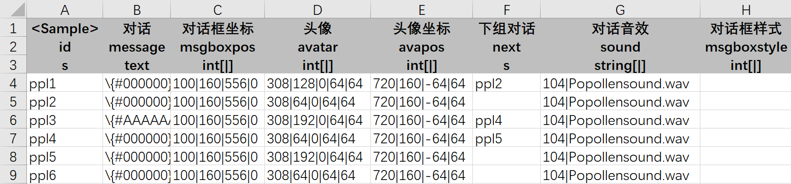
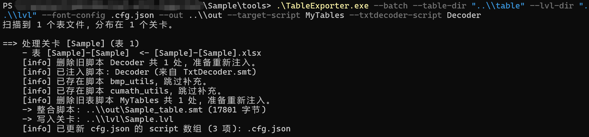
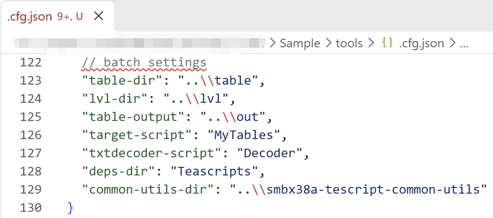
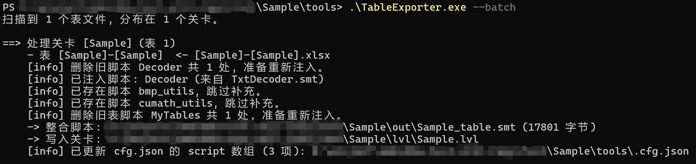
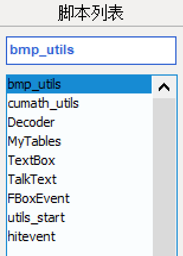
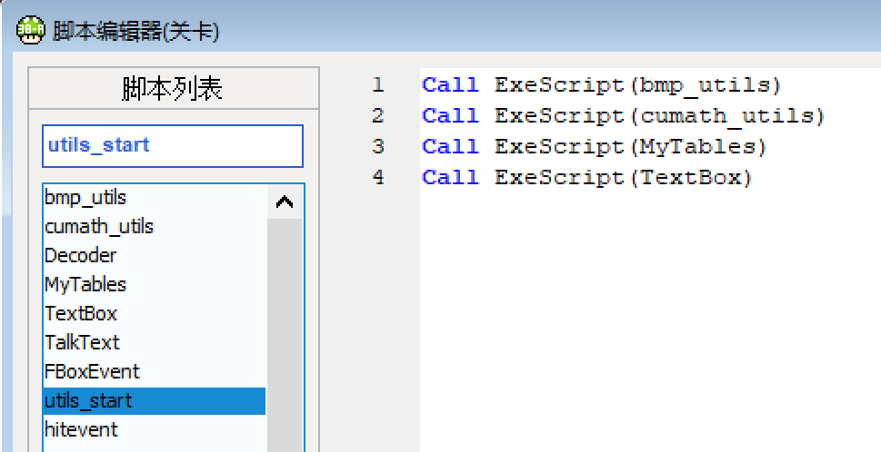
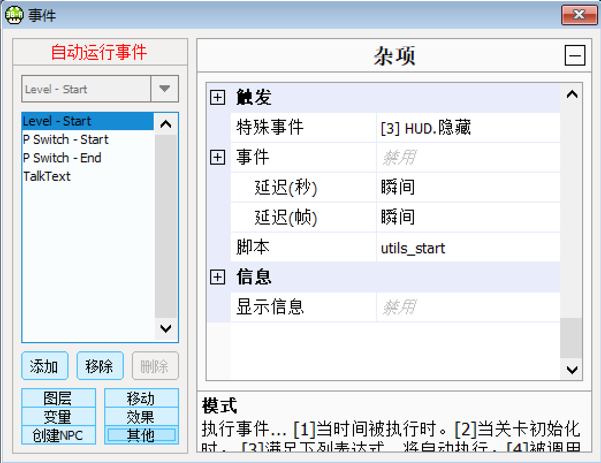
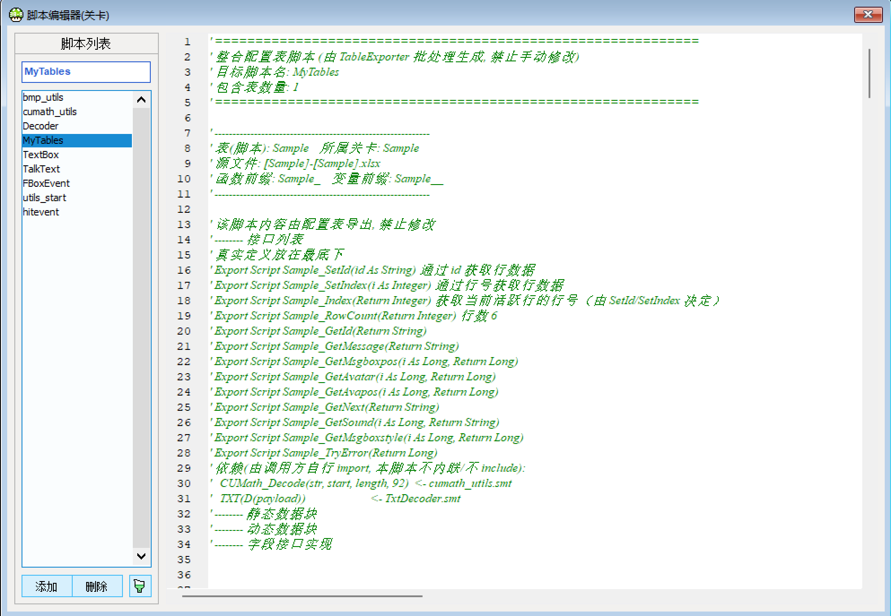
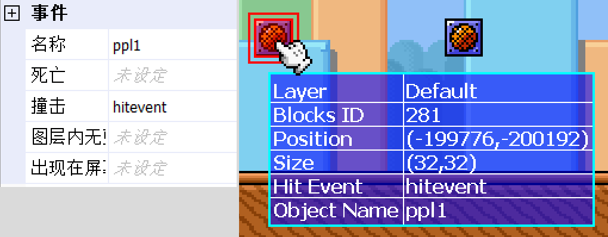
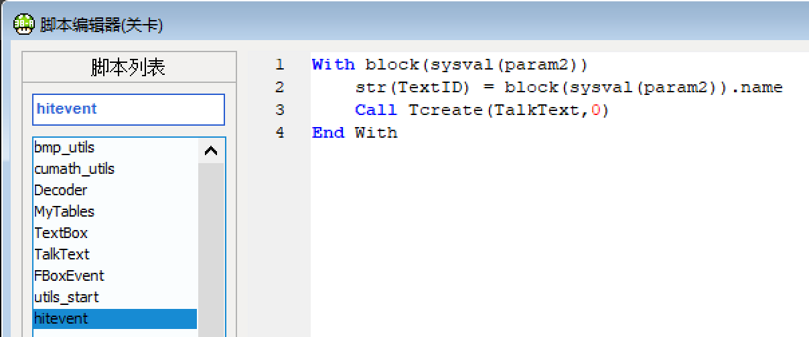

# TableExporter 使用说明

## 关于 TableExporter

TableExporter 是一个用于将 Excel 表格内的数据转换为可被直接用于 SMBX 关卡脚本的工具。可以将 TableExporter 理解为一个 Excel 到 TeaScript 的转换器。在处理大规模的使用表格的数据时，TableExporter 可以极大地提高工作效率。除此之外，TableExporter 还可以配合 FontAtlasGenerator 来生成带有字模的富文本并进行转码，放到 SMBX 关卡脚本中使用。

TableExporter 可以用于处理包含大量文本的数据，例如 NPC 对话文本等内容。在使用自定义对话系统时，TableExporter 处理对话文本的功能可以极大地提高工作效率。除了处理单个表格外，TableExporter 还可以处理一个目录下的所有表格，将所有表格的数据合并到一起的同时自动导入到 SMBX 的关卡脚本中。

## 基础指令

可使用 powershell 运行 TableExporter.exe 来执行相应指令，如导出指定表格的数据为 smt 格式的包含 SMBX-38A 茶脚本的文件。
```powershell
# 导出单张表
TableExporter.exe npc.csv -o out

# 含 text 列（需要字模转码）时，指定字体图集配置
TableExporter.exe text.xlsx -o out --font-config .cfg.json

# 批量导出到指定目录
TableExporter.exe tables\ -o out

# 内置自检
TableExporter.exe --self-test
```

## 表格格式

表格中的第一行用来写字段名的注释，其中 A1 处必须在 <> 中写上表格的名称，如在名为 text 的表格中的 A1 处写上 <text>。

表格中的第二行是字段名，字段名必须是英文，且不能有空格。其中 A2 处必须写上 id 字段，用于标记每行的唯一 id。

表格中的第三行是字段类型，字段类型必须是英文，且不能有空格。关于字段类型，请参考下表：

| 写法 | 含义 |
| --- | --- |
| `i/int` | 32 位整数 |
| `f/float` | 浮点数（定点保留 4 位小数） |
| `b/bool` | 布尔，接受 `0/1`、`true/false`、`yes/no` |
| `s/string` | 普通字符串 |
| `t/text` | 富文本，交给 FontAtlasGenerator 做字模转码 |
| `int[]` | 数组，默认以 `\|` 分隔 |
| `string[;]` | 数组，自定义分隔符 `;` |

如果表格的第二行和第三行为空，则被视为注释，TableExporter 会自动跳过。

如果要分多个表格，请另建新的表格文件，而不是在同一个表格文件中分多个表格。

## 批处理功能

批处理功能可以将一个关卡相关的所有配置表一次性导出，并整合进对应的 `.lvl` 关卡文件。

如果关卡内已经有先前导入的同名脚本，再次使用批处理功能时会覆盖该脚本。

### 表文件命名

表文件必须命名为 `[关卡名]-[表格名].xlsx`（也支持 `.xlsm` / `.csv`），例如：

```
[Test]-[char].xlsx        # 关卡文件名 Test.lvl，表格名 char
[Test]-[condition].xlsx   # 关卡文件名 Test.lvl，表格名 condition
[Test]-[text].xlsx        # 关卡文件名 Test.lvl，表格名 text
```

工具会**递归扫描** `--table-dir` 下的所有子目录，按 `[关卡名]` 分组：
同一个关卡的多张表会被合并成一个整合脚本。

### 使用方法

配置两个目录的方式分两种：其一是**控制台参数**，其二是**JSON 配置文件**（复用 FontAtlasGenerator 的 `.cfg.json`）。

#### 方式一：纯命令行

可使用 powershell 运行 TableExporter.exe 来执行相应指令。

```powershell
TableExporter.exe --batch `
    --table-dir "tables" `       # [lvl]-[script].xlsx 所在目录（递归扫描子目录）
    --lvl-dir   "levels" `       # <lvl名>.lvl 所在目录
    --font-config .cfg.json `    # FontAtlasGenerator 字体配置（含 text 列时必需）
    --font-atlas  "tools/FontAtlasGenerator.exe" `  # 可选，默认按名称在 PATH/同目录查找
    --out out `                  # 中间 .smt 输出目录（默认 out）
    --target-script TableExport `# 写入 lvl 的表整合脚本名（默认 TableExport）
    --txtdecoder-script TxtDecoder `# 写入 lvl 的 TxtDecoder 脚本名（默认 TxtDecoder）
    --common-utils-dir "..\smbx38a-tescript-common-utils" `# bmp_utils/cumath_utils 脚本目录（默认 exe 上级）
    --deps-dir "Teascripts"      # 可选，额外依赖脚本目录
```

其中 `--table-dir` 和 `--lvl-dir` 支持多个目录，用`|`分隔。

命令行实例：
```
TableExporter.exe --batch --table-dir "表格目录" --lvl-dir "关卡目录" --font-config .cfg.json --out 导出路径
```

#### 方式二：JSON 配置

在 `.cfg.json`（含 `//` 注释的 FontAtlasGenerator 配置）里增加：

```json
// batch settings
"table-dir":"tables",
"lvl-dir":"levels",
"table-output":"out",
"target-script":"TableExport",
"txtdecoder-script":"TxtDecoder",
"deps-dir":"Teascripts",
"common-utils-dir":"..\\smbx38a-tescript-common-utils"
```

其中 `table-dir` 和 `lvl-dir` 支持多个目录，用`|`分隔。

配置实例：
```json
// batch settings
"table-dir": "表格目录",
"lvl-dir": "关卡目录",
"table-output": "输出目录",
"target-script": "写入 lvl 的表整合脚本名（默认 TableExport）",
"txtdecoder-script": "写入 lvl 的 TxtDecoder 脚本名（默认 TxtDecoder）",
"deps-dir": "额外依赖脚本目录",
"common-utils-dir": "bmp_utils/cumath_utils 脚本目录（默认 exe 上级）"
```

然后在 powershell 中运行：
```
TableExporter.exe --batch
```
注：命令行参数优先级高于 JSON 配置。

## 茶脚本结构

TableExporter 可以将指定表格中的数据导出为一个茶脚本。使用批处理功能会将指定目录内所有表格的数据合并到一起，并写入到一个默认名为 `TableExport` （这个名称可以自定义）的茶脚本中。使用这样的茶脚本，就可以在 SMBX 中调用表格中的所有数据。

除此之外，TableExporter 的批处理功能还支持将关卡中的常规脚本按照编号进行排序，其格式为 `[编号] <脚本名>`，如 `[1] TextBox`、`[2] TalkText`。

### 脚本依赖

包含表格数据的脚本需要依赖 `cumath_utils` 脚本。若使用了富文本，则还需要依赖 `bmp_utils` 和 `TxtDecoder` 脚本。请确保这些依赖脚本在脚本列表中位于包含表格数据的脚本之前。

使用批处理功能时，会自动将 `cumath_utils`、`bmp_utils` 和 `TxtDecoder` 脚本移到关卡中并自动排序。除此之外也会将关卡中带有 `[编号]` 前缀的常规脚本按编号自动排序。

### 脚本接口

包含表格数据的脚本内包含多个函数，用于获取表格中的数据。以下是脚本中各个函数的名称和作用：

| 名称 | 作用 |
| --- | --- |
| `<表格名>_SetId` | 通过 id 获取行数据 |
| `<表格名>_SetIndex` | 通过行号获取行数据 |
| `<表格名>_Index` | 获取当前活跃行的行号（由 SetId/SetIndex 决定） |
| `<表格名>_RowCount` | 获取表格的行数 |
| `<表格名>_Get<字段名>` | 获取指定 id 的指定字段的数据，需要配合 `<表格名>_SetId` 使用 |
| `<表格名>_TryError` | 出错时用来获取对应的错误码 |

#### 错误码对照表

| 返回值 | 写入位置 | 失败的上游函数 | 错误类型 | 常见成因 |
| --- | --- | --- | --- | --- |
| `0` | `SetId` / `SetIndex` 开头 | — | 无已记录错误 | 定位成功；或尚未发生任何被记录的错误 |
| `-1` | `SetId` / `SetIndex` | `SeekDataMap` / `SeekDataMapByIndex` | **行定位失败** | id 不存在（或空 id）；行号越界 |
| `-2` | 各 `Get<字段名>` | `SeekChunk` | **字段索引表（data_map）定位失败** | 当前行无效（未调用 `Set*` 或上次失败）；data_map id 非法；字段槽位越界；取到空片段 |
| `-3` | 各 `Get<字段名>` | `LoadChunkFragment` | **数据片段（chunk）读取失败** | 该字段在本行为空；chunk 编号非法；数组下标越界 |

#### 使用示例

在使用指定表格内的数据时，需要先调用 `<表格名>_SetId` 函数来设置当前所需获取的行：

```
Call <表格名>_SetId(`id`)
```

这里的 `id` 是表格中每一行都有的字段，作为标记每行的唯一 id。

之后就可以使用 `<表格名>_Get<字段名>` 函数来获取指定字段的数据。

若想获取数组中指定的元素，可以使用 `<表格名>_Get<字段名>(index)` 来获取数组中第 `index` 个元素。如 `<表格名>_Get<字段名>(1)` 会获取数组中第一个元素。

## 实例讲解

### 准备工作

准备如下的表格，命名为 [[Sample]-[Sample].xlsx](..\\Sample\\table\\[Sample]-[Sample].xlsx)：



该表格的文件名的前半部分是关卡名，后半部分是表格名。表格中包含了对话系统所需的参数，包括对话的内容，对话框的大小和坐标，头像的内容和坐标等。

在这里，我们的目的是使用表格来轻松管理对话系统的参数。既然需要使用表格来管理对话系统的参数，那么就需要在关卡中调用表格中的这些数据。

### 导入数据

首先，我们要做的是将表格中的数据以脚本的形式导入到 SMBX 关卡中。通过 TableExporter 的批处理功能，可以轻松地将表格数据及相关依赖脚本导入到名为 [Sample.lvl](..\\Sample\\lvl\\Sample.lvl) 的 SMBX 关卡中：

这里有两种方法，其中第一种是使用命令行参数：
```powershell
TableExporter.exe --batch --table-dir "..\\table" --lvl-dir "..\\lvl" --font-config .cfg.json --out ..\\out --target-script MyTables --txtdecoder-script Decoder
```



第二种是使用 JSON 配置文件：

打开字体图集生成器的配置文件 [.cfg.json](..\\Sample\\config\\.cfg.json)，在最底下添加以下内容：

```json
// batch settings
"table-dir":"..\\table",
"lvl-dir":"..\\lvl",
"table-output":"..\\out",
"target-script":"MyTables",
"txtdecoder-script":"Decoder",
"deps-dir":"Teascripts",
"common-utils-dir":"..\\smbx38a-tescript-common-utils"
```



之后再使用命令行，输入以下命令：
```powershell
TableExporter.exe --batch
```



通过以上两种方法即可将表格数据及相关依赖脚本导入到 SMBX 关卡中。

### 使用数据

通过批处理功能将表格数据导入到 SMBX 关卡中后，我们就可以在关卡中使用表格中的数据了。这次的示例是通过表格的数据来管理对话系统的参数，既然如此，关卡中也需要将对话系统相关的脚本导入到关卡中。最终的脚本列表如图所示：



可以看到在批处理以后，脚本列表将表格数据脚本所需的依赖脚本安排在了最前面，随后才是表格数据脚本，之后则是关卡中的其他脚本。

为了确保能正常调用表格数据，我们需要一个脚本在关卡中调用必要的其他脚本，并在关卡开始事件中调用该脚本：




上图的 `utils_start` 脚本就是用来调用必要的其他脚本（包括依赖脚本、表格数据脚本和对话框脚本）的，在关卡开始事件中调用该脚本后就可以确保在关卡开始时同时调用以上这些脚本了。

从上面这张图的事件列表中还可以看到一个名为 `TalkText` 的事件，该事件是用来调用同名脚本，并触发对话框的显示的。因为调用对话框的显示是需要让玩家来主动触发的，因此需要将该脚本单独设置在一个事件中，并在玩家做出指定的行为后触发该事件以显示对话框。

来看 `TalkText` 脚本自身：该脚本是用来调用表格数据脚本并触发对话框显示的，在该脚本中，我们需要先调用表格数据脚本中的相关接口来获取对话框的相关参数，然后再调用对话框脚本来显示对话框。

首先我们来看先前导入的 `MyTables` 表格数据脚本，可以看到该脚本的开头存在着一些注释，这些注释解释了这个表格的大致情况及包含的接口名称及作用：



在了解了表格数据脚本的接口后，我们就可以在 `TalkText` 脚本中通过这些接口调用表格中的数据，以让对话框按我们在表格中设置的预期正确显示了。

`TalkText` 脚本中包含多个对话框的参数的调用，这里我们只举部分例子来讲解：

```
If Msgprogress = "" Then '当前对话由对话 npc 发起
    Call Sample_SetId(str(TextID)) '设定对话ID
Else '当前对话由上一个对话触发
    Call Sample_SetId(Msgprogress)
End If
Msgprogress = ""
tempstr = Sample_GetNext() '获取下一个对话的ID（如果有）
If tempstr <> "" Then
    Msgprogress = tempstr
End If
```

从上述的脚本中，我们可以看到，在一开始，脚本通过代码 `Call Sample_SetId(str(TextID))` 来调用表格中指定 ID 的行数据，而这里的 ID 是通过字符串 `str(TextID)` 来获取的。

在那之后，脚本通过代码 `tempstr = Sample_GetNext()` 来获取下一个对话的 ID，并在判断 `tempstr` 的数据不为空后将 `tempstr` 赋值给 `Msgprogress`，以便在结束当前对话、进入下一个对话时（也就是在字符串 `Msgprogress` 不为空时）使用该 ID。这里使用中间变量 `tempstr` 来获取下一个对话的 ID 是为了防止过于频繁的调用表格数据脚本而导致性能下降，其他地方的情况同理。

```
s = TXT(D(Sample_GetMessage())) '获取对话文本
templong = Sample_GetMsgboxstyle(1) '获取对话框样式
If templong <> 0 Then
    __grid = templong
Else
    __grid = 0
End If
Call Textbox_StoreMsgFromShape(100, 160, 556, 0)
tempstr = Sample_GetSound(1) '获取角色对话音效
If tempstr <> "" Then
    Call Textbox_Setsound(cdbl(tempstr), Sample_GetSound(2))
End If
templong = Sample_GetAvatar(1) '获取对话头像
If templong <> 0 Then
    Call Textbox_StoreAvatar(templong, Sample_GetAvatar(2), Sample_GetAvatar(3), Sample_GetAvatar(4), Sample_GetAvatar(5))
    Call Textbox_StoreAvatarFromShape(720, 160, 64, 0)
End If
templong = Sample_GetAvapos(1) '获取对话头像数据
If templong <> 0 Then
    Call Textbox_StoreAvatarShape(templong, Sample_GetAvapos(2), Sample_GetAvapos(3), Sample_GetAvapos(4))
End If
templong = Sample_GetMsgboxpos(1) '获取对话框数据
If templong <> 0 Then
    Call Textbox_StoreMsgShape(templong, Sample_GetMsgboxpos(2), Sample_GetMsgboxpos(3), Sample_GetMsgboxpos(4))
End If
Call TextBox_Submit(s, -1) ' 提交带头像的对话框
```

以上是 `TalkText` 脚本中对于对话框的其他参数的调用。可以看到，在正式调用表格数据前，我们是先用一个中间变量来获取表格数据，并判断该数据的值是否为空，若不为空则使用该数据，否则使用默认值。

在编写脚本 `TalkText` 的工作告一段落后，我们需要确保玩家在游戏中做出指定行为后可以触发对话框的显示。这里我们以玩家顶砖块为例，玩家在顶特定的砖块后会触发指定对话文本显示。而为了能确保顶砖块后可以触发指定对话文本的显示，我们给砖块的 `name` 参数赋值为对话文本的 ID，并在砖块的撞击事件中调用 `hitevent` 脚本并传入对话文本的 ID 参数：




这样一来，玩家在顶砖块后就会将砖块的 name 参数的内容传递给字符串 `str(TextID)`（`str(TextID) = block(sysval(param2)).name`），并调用 `TalkText` 事件（`Call Tcreate(TalkText,0)`），从而调用同名脚本以触发对话框的显示。

### 最终效果


最终实现的效果如图所示，玩家在顶砖块后会触发对话框的显示，该对话框会正确调用表格中指定 ID 行数据中的参数和对话文本。